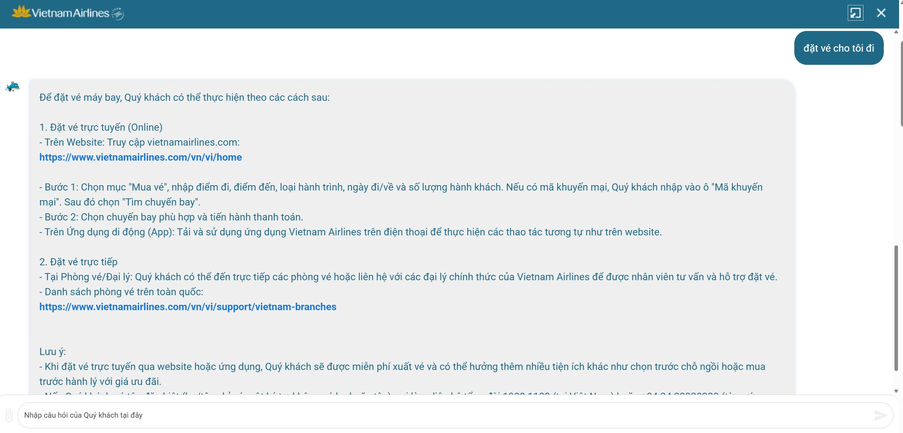

# Workshop — Mổ App AI Thật

**Họ tên:** Trần Mạnh Chánh Quân — 2A202600786
**Ngày:** 03/06/2026

---

## 1. Sản phẩm được chọn

| Trường | Thông tin |
|---|---|
| **Tên sản phẩm** | Vietnam Airlines — NEO |
| **AI feature** | Chatbot hỗ trợ đặt vé, tra cứu hành lý, giải quyết khiếu nại |
| **Cách truy cập** | Website vietnamairlines.com (widget chat góc phải) |
| **Lý do chọn** | NEO được quảng bá là AI assistant có thể "đặt vé cho tôi" — đây là tác vụ có thể kiểm tra intent rõ ràng |

---

## 2. Promise vs Reality

### Product hứa gì?

NEO là AI assistant của Vietnam Airlines, được giới thiệu có thể hỗ trợ hành khách **đặt vé, tra hành lý, xử lý khiếu nại** qua chat — thay thế một phần luồng tự phục vụ trên website và tổng đài.

### User nào được hứa sẽ được giúp?

Hành khách muốn đặt vé nhanh mà không cần tự điều hướng qua website — đặc biệt những người chưa quen giao diện hoặc muốn hoàn thành booking chỉ bằng chat.

### Task kỳ vọng AI làm được?

1. Hỏi thêm thông tin (điểm đi, điểm đến, ngày, số hành khách) rồi tự động điền form tìm chuyến bay.
2. Hiển thị danh sách chuyến bay phù hợp và dẫn thẳng vào bước chọn ghế / thanh toán.
3. Nếu chưa đủ thông tin, hỏi lại từng trường thay vì đưa hướng dẫn chung.

### Điểm gãy khi dùng thật

Khi user nhấn nút **"đặt vé cho tôi đi"**, NEO không hỏi thêm thông tin và không thực hiện tác vụ. Thay vào đó, chatbot liệt kê quy trình đặt vé thủ công (truy cập website → bước 1 → bước 2...) như một FAQ bot — tức là **chuyển intent "làm giúp tôi" thành "giải thích cách tự làm"**.

### Evidence

- **Screenshot:** 
- **Prompt/input đã thử:** Nhấn nút quick-reply `"đặt vé cho tôi đi"` — input rõ ràng, không mơ hồ.
- **Quote từ response của NEO:**
  > "Để đặt vé máy bay, Quý khách có thể thực hiện theo các cách sau: 1. Đặt vé trực tuyến (Online)..."
- **Hành vi quan sát được:** Bot không hỏi điểm đi/đến, không mở form, không đưa lựa chọn chuyến bay — chỉ trả về văn bản hướng dẫn tĩnh.

---

## 3. Bốn Paths

### Happy Path

> Khi AI đúng và tự tin, user thấy gì?

User nhấn "đặt vé cho tôi đi" → NEO hỏi lần lượt: điểm đi, điểm đến, ngày, số hành khách → tự điền vào search form → trả về danh sách chuyến phù hợp với nút CTA "Chọn chuyến này" → user chọn ghế → thanh toán. Toàn bộ trong cửa sổ chat.  
*(Path này hiện KHÔNG tồn tại trong product.)*

### Low-confidence Path

> Khi AI không chắc, hệ thống có hỏi lại, show options hoặc chuyển người không?

**Không.** NEO không có cơ chế hỏi lại khi intent mơ hồ hoặc thiếu thông tin. Khi input là "đặt vé cho tôi đi" (rõ intent nhưng thiếu chi tiết), bot không hỏi thêm mà rơi thẳng vào response FAQ tĩnh. Không có nút "gặp tư vấn viên" hay danh sách options để chọn.

### Failure Path

> Khi AI sai, user biết bằng cách nào và sửa thế nào?

User nhận ra bot "sai" vì response hoàn toàn không thực hiện tác vụ — chỉ liệt kê hướng dẫn văn bản. Không có thông báo lỗi, không có nút thử lại hay escalate. User phải tự đóng chat và vào website làm thủ công — đúng như hướng dẫn bot vừa đưa ra.

### Correction Path

> Khi user sửa, correction có được lưu/log/học lại không hay biến mất?

Không có correction path. Nếu user gõ lại câu hỏi cụ thể hơn (VD: "đặt vé Hà Nội đi Đà Nẵng ngày 10/6"), bot có thể trả lời khác, nhưng không có cơ chế lưu context từ lượt trước, không học từ correction, mỗi lần là một session độc lập.

---

## 4. Finding → Product Decision

> **Template:**
> Khi user [trigger],
> AI/product [failure],
> hậu quả là [impact].
> Lỗi thuộc layer [promise / intent / data-tool / safety / UX recovery].
> Nên sửa bằng [requirement / UX / fallback / human role / test case].

---

**Finding 1:**

Khi user nhấn nút quick-reply "đặt vé cho tôi đi",
AI/product không nhận diện đây là intent hành động (booking task) mà xử lý như intent tra cứu thông tin (how-to query), trả về hướng dẫn văn bản tĩnh thay vì bắt đầu luồng thu thập thông tin,
hậu quả là user không đặt được vé qua chat, phải thoát ra và tự thao tác trên website — trải nghiệm chatbot không tạo ra giá trị so với không dùng chatbot.
Lỗi thuộc layer **Intent** (phân loại sai intent action vs. intent info) + **Promise** (product hứa "đặt vé giúp bạn" nhưng chỉ deliver FAQ).
Nên sửa bằng: Thêm intent class `BOOKING_INITIATE`; khi khớp, trigger slot-filling flow hỏi lần lượt: điểm đi → điểm đến → ngày → số hành khách → tự gọi search API và trả về kết quả dạng card thay vì text.

---

**Finding 2:**

Khi user có intent rõ nhưng thiếu tham số (không nói điểm đi, ngày),
AI/product không hỏi lại để làm rõ mà rơi ngay vào fallback response FAQ tĩnh,
hậu quả là user không biết mình cần cung cấp thêm gì, conversation bị chết sớm.
Lỗi thuộc layer **Intent** (thiếu slot-filling / clarification loop) + **UX Recovery** (không có low-confidence path).
Nên sửa bằng: Khi intent = `BOOKING_INITIATE` nhưng thiếu slot, bot hỏi lại từng trường còn thiếu với prompt ngắn gọn (VD: "Bạn muốn bay từ đâu?"), không trả FAQ cho đến khi đủ thông tin.

---

## 5. Sketch As-is / To-be

### As-is (flow hiện tại)

```
[User] → nhấn "đặt vé cho tôi đi"
              ↓
         [NEO nhận input]
              ↓
         [Phân loại sai: xử lý như FAQ query ⚠️]
              ↓
         [Trả về văn bản: "Để đặt vé, Quý khách thực hiện..."]
              ↓
         [User đọc hướng dẫn → tự vào website → tự làm]
              ↓
         [Chat không tạo giá trị — user bỏ qua chatbot lần sau]
```

### To-be (flow đề xuất)

```
[User] → nhấn "đặt vé cho tôi đi"
              ↓
         [NEO nhận intent: BOOKING_INITIATE ✅]
              ↓
         [Slot-filling: "Bạn muốn bay từ đâu?"] ← hỏi từng trường còn thiếu
              ↓
         [User: "Hà Nội"] → [NEO: "Bay đến đâu?"]
              ↓
         [User: "Đà Nẵng, 10/6, 1 người"]
              ↓
         [NEO gọi search API → trả về card danh sách chuyến bay ✅]
              ↓
         [User nhấn "Chọn" → đến trang thanh toán]
```

---

## 6. Self-check trước khi nộp

- [x] Có ít nhất 1 screenshot hoặc observation cụ thể.
- [x] Có đủ 4 paths hoặc nói rõ path nào chưa có trong product.
- [x] Finding được viết thành product decision, không chỉ là nhận xét.
- [x] Sketch có as-is và to-be.
- [x] Có một câu nói rõ finding này sẽ đổi gì trong SPEC.

### Finding này sẽ đổi gì trong SPEC?

SPEC cần bổ sung hai requirement mới cho NEO:
1. **Intent classification requirement:** Thêm intent `BOOKING_INITIATE` riêng biệt với `BOOKING_INFO`; khi user dùng quick-reply đặt vé hoặc câu có động từ hành động ("đặt", "mua", "book"), phải trigger slot-filling flow, không được fallback về FAQ.
2. **Slot-filling / low-confidence requirement:** Khi intent là hành động nhưng thiếu tham số bắt buộc (origin, destination, date), chatbot phải hỏi lại từng trường còn thiếu — không được trả response hoàn chỉnh cho đến khi đủ slot.
